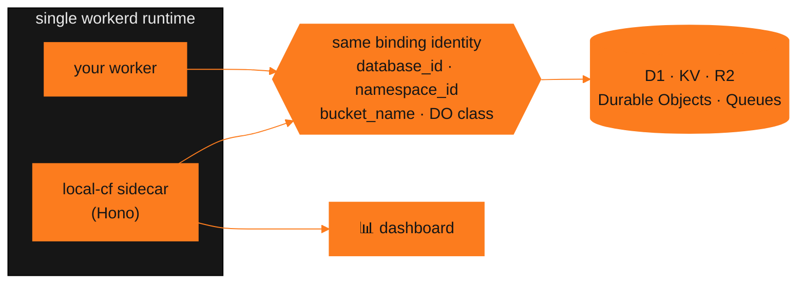

<div align="center">


<h1>local-cf</h1>

<a href="https://git.io/typing-svg">
  
</a>

<p><b>A local-first studio for Cloudflare Workers.</b><br/>
Browse and edit the <b><i>exact</i></b> D1 databases, KV namespaces, R2 buckets, Durable Objects<br/>
and Queues your worker is using — same runtime, offline, no Cloudflare account required.</p>

<p>
  <a href="https://www.npmjs.com/package/local-cf"></a>
  <a href="https://www.npmjs.com/package/local-cf"></a>
  <a href="#license"></a>
  <a href="https://www.local-cf.com"></a>
</p>

<p>
  
  
  
  
  
</p>

<a href="https://www.local-cf.com"><b>Website</b></a> &nbsp;·&nbsp;
<a href="https://github.com/Hirusha-Nikson/local-cf"><b>Source</b></a> &nbsp;·&nbsp;
<a href="https://github.com/Hirusha-Nikson/local-cf/issues"><b>Issues</b></a> &nbsp;·&nbsp;
<a href="https://github.com/sponsors/Hirusha-Nikson"><b>❤️ Sponsor</b></a>

</div>


## ⚡ Quick start

```bash
# 🔒 read-only — browse everything, change nothing
npx local-cf

# ✏️ read & write — full studio, edits land on your real local data
npx local-cf dev
```

<table>
<tr><th align="left">Command</th><th align="left">Access</th><th align="left">Use it when</th></tr>
<tr>
<td><code>npx local-cf</code></td>
<td><b>🔒 Read-only</b></td>
<td>You just want to look — inspect state without any risk of mutating it</td>
</tr>
<tr>
<td><code>npx local-cf dev</code></td>
<td><b>✏️ Read &amp; write</b></td>
<td>You want the full studio — edit rows, keys, objects, send messages</td>
</tr>
</table>

Run either from a directory containing a `wrangler.toml` / `wrangler.jsonc`, then open
the dashboard URL it prints. That's the whole setup.


## 🎯 Why local-cf

> Most local tooling shows you a **copy** of your data. `local-cf` shows you **the data**.

`local-cf` boots **one** `workerd` runtime containing two workers — yours, and a small
Hono sidecar — and gives the sidecar bindings with the *same resource identity* as
yours: same `database_id`, same `namespace_id`, same `bucket_name`, same Durable
Object class.

Miniflare resolves both workers to the same underlying objects, so an
**un-checkpointed Durable Object write is visible in the dashboard immediately** —
not after the next flush.

<details>
<summary><b>🧩 How that fits together (diagram)</b></summary>

<br/>



</details>


## 🚀 Modes

Every mode below runs read-only by default; `dev` is what unlocks writing.

<table>
<tr>
<td width="33%" valign="top">

### `dev` — Mode A
**`local-cf dev`**

Runs your worker **and** the studio in one runtime.

✅ Live Durable Object state<br/>
✅ Full binding parity<br/>
✅ Strongest guarantee<br/>
✏️ Read & write — plain `local-cf` is the read-only view

</td>
<td width="33%" valign="top">

### `attach` — Mode B
**`local-cf attach`**

Attaches to a dev server you don't control, over its persist directory.

⚠️ Disk state only<br/>
⚠️ No live DO or Queue state<br/>
ℹ️ Bindings labelled in the UI

</td>
<td width="33%" valign="top">

### `remote` — Mode C
**`local-cf remote`**

Browses **real** Cloudflare resources through the API.

🔑 `--account-id` / `--api-token`<br/>
🔑 or `CLOUDFLARE_ACCOUNT_ID`<br/>
&nbsp;&nbsp;&nbsp;&nbsp;&nbsp;`CLOUDFLARE_API_TOKEN`

</td>
</tr>
</table>

> **On Mode B:** it is a genuinely weaker guarantee than Mode A — no live Durable
> Object or Queue state, just what's on disk. The dashboard labels bindings
> accordingly rather than implying parity.


## ⚙️ Options

Common to `dev` / `attach` / `remote`:

| Option | Description |
| :--- | :--- |
| `-p, --port <port>` | Port to listen on |
| `--host <host>` | Host to bind to |
| `-e, --env <environment>` | Wrangler environment to use |
| `-c, --config <path>` | Path to `wrangler.toml` / `wrangler.jsonc` |
| `--persist-to <path>` | Override the persist directory |
| `--no-watch` | Do not rebuild the worker on file changes |
| `-q, --quiet` | Suppress worker logs in the terminal |
| `--open` | Open the dashboard in your browser |

`remote` additionally takes `--account-id` / `--api-token`, or reads
`CLOUDFLARE_ACCOUNT_ID` / `CLOUDFLARE_API_TOKEN` from the environment.


## 📦 What works today

<details open>
<summary><b>Bindings</b></summary>

<br/>

| | Binding | Capabilities |
| :---: | :--- | :--- |
| 🗄️ | **D1** | Table browser with paging · SQL editor · CSV export · migration list & apply, tracked in `d1_migrations` |
| 🔑 | **KV** | Key list with prefix filter · value editor (UTF-8 and base64) · TTL · JSON import/export |
| 🪣 | **R2** | Object listing · upload · download · delete |
| 🧬 | **Durable Objects** | name→id resolution · live request inspection |
| 📨 | **Queues** | Send single messages · consumer & DLQ config view |

</details>

<details open>
<summary><b>Tooling</b></summary>

<br/>

| | Feature | Capabilities |
| :---: | :--- | :--- |
| 📜 | **Logs** | Polled tail of worker `console.*` output |
| 💾 | **Snapshots** | Copy and restore the whole persist directory |
| 🧾 | **Audit log** | Every dashboard write recorded, with undo where an inverse exists |


## 🚧 Known limitations

- Workers importing `.wasm` modules are **not bundled yet**.
- Durable Object *storage* cannot be read directly — the runtime exposes no API for
  it. The DO view talks to instances instead; give your class a `/debug` route and
  it becomes browsable.
- Queue depth and DLQ contents are not observable from another worker.


## ❤️ Sponsor

`local-cf` is MIT, free, and built and maintained by one person in his own time.
There is no company behind it and nothing is gated behind a paid tier — the whole
studio is what you get with `npx local-cf`.

If it saved you a deploy-and-pray cycle, sponsoring keeps the release notes coming:

<p>
  <a href="https://github.com/sponsors/Hirusha-Nikson"></a>
</p>

Sponsorship goes to maintenance, not features-for-hire: keeping up with `workerd` and
Wrangler releases, widening binding coverage, and closing the gaps in
[Known limitations](#-known-limitations). **Companies** shipping on Workers who want
`local-cf` to stay current are the most useful sponsors of all — one seat's worth a
month covers a lot of runtime-upgrade churn.

Not in a position to sponsor? Starring the repo, filing a good bug report, or telling
another Workers developer it exists genuinely helps too.


## 🔗 Links

| | |
| :--- | :--- |
| 🌐 Website | [www.local-cf.com](https://www.local-cf.com) |
| 📖 Source & full docs | [github.com/Hirusha-Nikson/local-cf](https://github.com/Hirusha-Nikson/local-cf) |
| 🐛 Issues | [Report a bug](https://github.com/Hirusha-Nikson/local-cf/issues) |
| 📦 npm | [npmjs.com/package/local-cf](https://www.npmjs.com/package/local-cf) |
| ❤️ Sponsor | [github.com/sponsors/Hirusha-Nikson](https://github.com/sponsors/Hirusha-Nikson) |

## License

MIT — see [LICENSE](./LICENSE).

## Trademarks

`local-cf` is an independent project and is **not affiliated with, endorsed by, or
sponsored by Cloudflare, Inc.** Cloudflare, Workers, D1, R2, KV, Durable Objects,
Queues and Wrangler are trademarks of Cloudflare, Inc., referenced here only to
describe compatibility.

<div align="center">
<br/>
<sub>Built for people who'd rather not deploy to see their data.</sub>
<br/><br/>
<a href="https://www.local-cf.com"></a>
</div>